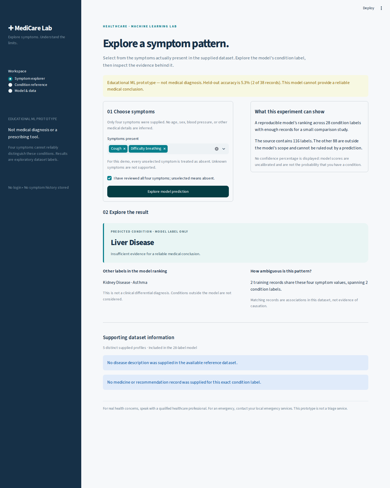

# MediCare Lab

An educational symptom-to-condition ML prototype, rebuilt from the supplied
Personalized Healthcare & Medicine Recommendation System materials.

**Not medical diagnosis, triage, or a prescribing tool.** The selected model
correctly predicts **2 of 38 held-out records (5.26%)**.
It is not clinically useful. Completing the software does not validate its
medical predictions. No fabricated medical descriptions or recommendations are used.



## Run on Windows (PowerShell)

Use Python 3.12. Extract the project ZIP and open a terminal in `healthcare_final`.
Using the virtual environment's Python directly avoids activation-policy problems.

```powershell
py -3.12 -m venv .venv
.\.venv\Scripts\python.exe -m pip install -r requirements.txt
.\.venv\Scripts\python.exe -m streamlit run app.py
```

Open `http://localhost:8501` in your browser. The bundled model is ready to use;
training is not required to launch. The server binds to localhost by default.

## Run on Linux or macOS

```bash
python3.12 -m venv .venv
.venv/bin/python -m pip install -r requirements.txt
.venv/bin/python -m streamlit run app.py
```

## Deploy on Render

Source repository: [jairus011/medicare-lab](https://github.com/jairus011/medicare-lab).
The repository includes `render.yaml` for a single free Python web service in
Frankfurt. Deployment status must be checked in Render; the presence of this
configuration alone does not mean a live application exists.

| Setting | Value |
| --- | --- |
| Branch | `main` |
| Python | `3.12.14` |
| Build command | `python -m pip install -r requirements.txt && python -m healthcare.verify` |
| Start command | `bash scripts/start.sh` |
| Health check path | `/_stcore/health` |
| Instance plan | Free |

The startup script verifies the saved artifacts and binds to `0.0.0.0` on
Render's `PORT`, defaulting to `10000`. It uses the bundled evaluated model;
deployment does not train a new model. No secrets, database, or persistent disk
are required. Python is explicitly pinned because Render's default can differ
from the tested runtime. See Render's [port binding documentation](https://render.com/docs/web-services#port-binding)
and [Python version settings](https://render.com/docs/python-version).

For a new deployment, open [the Render Blueprint setup](https://dashboard.render.com/blueprint/new?repo=https://github.com/jairus011/medicare-lab)
after the repository has been pushed. Use either that Blueprint or a directly
created web service with the settings above, so that only one service is created.
Render's free service sleeps after 15 minutes without inbound traffic and takes
about a minute to wake up; [free-plan usage limits also apply](https://render.com/docs/free).
The app remains an educational prototype with the limitations stated above.

To exercise a running deployment through a real browser, replace the URL below
with the actual URL returned by Render:

```bash
python scripts/browser_smoke.py --url https://YOUR-SERVICE.onrender.com --output-dir tmp/hosted-checks
```

## Reproduce the experiment and run tests

With the environment active (or substitute its full Python path):

```bash
python -m pip install -r requirements-dev.txt
python -m healthcare.train --output-dir reproduction
python -m pytest
```

`requirements-lock.txt` also pins the resolved transitive dependencies for Python
3.12, with platform markers for Windows/macOS/Linux. Use it when you want a full
development-environment lock: `python -m pip install -r requirements-lock.txt`.
The recorded runtime and test results were produced on Linux; Windows launch
instructions are supplied, but no Windows machine was available for testing.

`reproduction/models` and `reproduction/reports` are independent outputs; the
shipped holdout and model remain available for comparison. `python -m
healthcare.train` without `--output-dir` deliberately rebuilds the local models
and reports. Run it only when that overwrite is intended. The final notebook
reruns the experiment into a temporary directory and asserts identical predictions,
scores, selected model, and split manifest against the shipped results.

Rebuild source display entries with `python scripts/prepare_references.py`.
Rebuild the human-readable deliverables with `python scripts/build_deliverables.py`.
To execute a freshly rebuilt notebook: `python scripts/execute_notebook.py --in-process`.
This executes real cells through IPython and captures their actual rich outputs.
That mode was verified here; this container restricts standalone kernel sockets.
Normal Jupyter execution is also available by omitting `--in-process` on a system
that supports kernel networking. The notebook can be opened normally in VS Code/Jupyter.
Optional screenshots: `python -m playwright install chromium`, then run
`python scripts/browser_smoke.py --start-server`. The test starts and stops the
local Streamlit server automatically. No website is published by these commands.

## What the app does

- **Symptom explorer:** select fever, cough, fatigue, and/or difficulty breathing;
  explicitly confirm that unselected symptoms are absent; see a predicted label,
  two other ranked labels, and ambiguity among matching training records.
- **Condition reference:** browse all 116 exact source labels, including labels
  outside the classifier. Ten labels have source reference entries; nine can show
  a limited, unverified display subset. Missing data stays visibly missing.
- **Model & data:** inspect CV comparisons, holdout results, class coverage,
  exclusions, and the confusion matrix. No probability-of-disease claim is made.

The app has no login or user-history database. It does not log selected symptoms
or contact external APIs. Streamlit usage telemetry is disabled. Selections exist
only in the current session. No real personal information is needed for a demo.

## Dataset and scope

The only complete labelled table supplied is `Cleaned_Dataset.csv`: 349 rows,
116 disease labels, and four symptom features. Removing 49 exact duplicate
profile/label records leaves 300. A **predefined five-profile minimum** retains
195 records across 28 labels for this small experiment; 105 records across 88
labels are excluded. No `Other` class or medical alias guesses are introduced.

This eligibility check uses the source label counts to define the study before
splitting. It is a conditional benchmark, not performance across all 116 labels.
Out-of-scope diseases cannot be detected, excluded, or ruled out by the model.

The notebook's 4,920-row `Training.csv`, its six reference CSVs, and the separate
drug-similarity notebook's `medicine.csv` are unavailable. The three symptom
notebook uploads are identical; the drug-similarity notebook is a separate task.
See [the complete source audit](reports/source_audit.md).

## Evaluation design

1. Preserve the original CSV and checksum. Deduplicate identical raw profiles
   with the same label; retain conflicting labels without inventing a resolution.
2. Group records by all eight raw pre-outcome profile fields, without the target.
   This keeps identical full profiles together. It is a duplicate-group proxy,
   not proof of patient independence; patient/site/time identifiers are absent.
3. Reserve the first fixed five-fold StratifiedGroupKFold partition (seed 42):
   **157 training records / 38 test records**, with all 28 labels in both sets.
4. Compare seven fixed candidate classifiers in four grouped folds of training
   data. Choose by macro F1, then balanced accuracy, then predefined simplicity.
   No hyperparameter search or model choice uses the test results.
5. Fit the winner on the 157 training records; evaluate it and the dummy baseline
   on the held-out set. Save that exact evaluated model; do not refit on test data.

Only the four raw binary symptoms enter the pipeline. No scaling is necessary.
The conversion step is stateless and serialized with the classifier. Outcome,
disease-derived risk, globally scaled copies, and non-UI context fields are
excluded. The original scaled columns match transforms fitted on all source rows.
The full-profile train/test group overlap is zero. Thirteen four-symptom patterns
are shared by different profiles across the split; that is reported explicitly.
An additional training-only stress test holds out entire symptom patterns and has
macro F1 **0.0037**. It is not used for selection.

The use of consistent preprocessing and training-only fitting follows
[scikit-learn's leakage guidance](https://scikit-learn.org/stable/common_pitfalls.html).
Group separation uses [StratifiedGroupKFold](https://scikit-learn.org/stable/modules/generated/sklearn.model_selection.StratifiedGroupKFold.html).

## Measured results

| Holdout metric | Selected random forest | Dummy prior |
| --- | --- | --- |
| Accuracy | 5.26% | 7.89% |
| Macro F1 | 0.0298 | 0.0052 |
| Balanced accuracy | 2.38% | 3.57% |
| Top-3 accuracy | 13.16% | 18.42% |

The winner is **Random forest**, selected by CV macro F1
**0.0452**. It underperforms the dummy in test
accuracy and top-3 accuracy, although its macro F1 is higher. It remains the saved
CV-selected artifact; the test set was not used to switch models afterward.

The 95% group-bootstrap interval for test accuracy is **0.0% to 13.9%**
(2,000 resamples of only 33 holdout profile groups). This is a very uncertain,
conditional estimate, not a clinical confidence statement. Precision, recall,
F1 and support for each label, error rows, CV folds, and the split manifest are
included in `reports/`. AUROC and calibrated probabilities are not advertised:
this small multiclass split cannot support a meaningful clinical calibration claim.

## Source-grounded reference policy

`medicine_database.source.json` is an inert, exact-content conversion of the
provided dictionary **for audit, not clinical use**. `display_reference.json`
contains only manually reviewed exact medicine-name substrings, verbatim diet
entries, and source-reported course text. Every item points back to its source
field/index; medication substrings carry a source-text checksum. Reference data
is never a training feature. All entries are unverified and opt-in in the UI.

The source has no disease-description field. The app says so. It does not use
an LLM or the internet to invent missing text. Dose schedules, advice and triage
instructions, and region-specific numbers are omitted. Stroke recommendation
fields are withheld because the source contains conflicting emergency directions.
No drug similarity results are offered as medication substitutes.

## Project contents

| Path | Purpose |
| --- | --- |
| `app.py` | Streamlit application |
| `healthcare/data.py` | Input schema, validation, scope, duplicate grouping |
| `healthcare/train.py` | Reproducible model selection, holdout evaluation and export |
| `healthcare/inference.py` | Artifact checks, shared inference, reference lookups |
| `data/raw/` | Original complete CSV |
| `data/reference/` | Inert source JSON and traceable display subset |
| `models/` | Exact evaluated pipeline and metadata/checksums |
| `notebooks/healthcare_final.ipynb` | Executed final analysis and reproducibility checks |
| `reports/` | Source audit, data audit, split and error tables, metrics, figures, PDF |
| `screenshots/` | Actual browser captures and browser test summary |
| `tests/` | Data, artifact, source fidelity and Streamlit tests |
| `scripts/` | Reference, document, notebook and browser reproduction tools |

## Limitations and next requirements

This is a completed educational software project with an inadequate clinical
dataset. There is no demonstrated personalization, external validation, patient
independence, reliable diagnosis, validated treatment recommendation, fairness
assessment, or clinical outcome evidence. Source provenance and reuse license
are undocumented. No claim is made that the records are real patients.

Before a serious research extension: recover the actual missing datasets and
their licenses; obtain richer, clinically governed symptom data with patient/site/
time identifiers; define intended use and exclusions; have qualified reviewers
validate reference content; then pre-register and run new external evaluation.
Do not tune repeatedly against the included 38-record holdout.

## Troubleshooting

- **Model/data not found:** extract the whole ZIP and launch from its project
  directory. Do not move `app.py` out of the project.
- **Version or integrity mismatch:** install the exact requirements in a fresh
  Python 3.12 environment, restore the shipped files, or explicitly retrain.
- **Port 8501 in use:** add `--server.port 8502` and open that port instead.
- **Notebook kernel missing:** install development requirements and select that
  environment as the notebook kernel in VS Code/Jupyter.

Load only the bundled model or models you trained and trust; joblib/pickle files
can execute code. The app never accepts user-uploaded model files. Checksums
detect accidental changes; they are not a digital signature or an authenticity proof.
